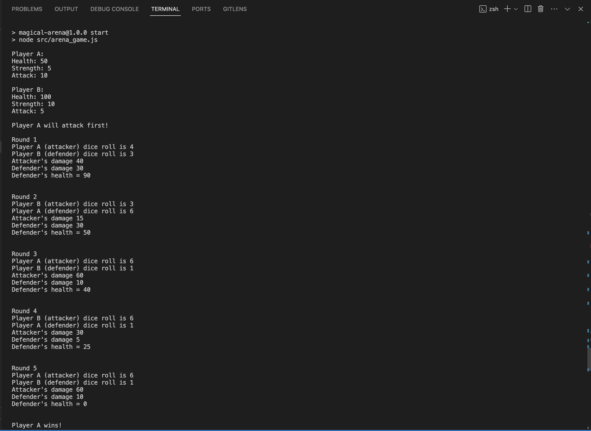
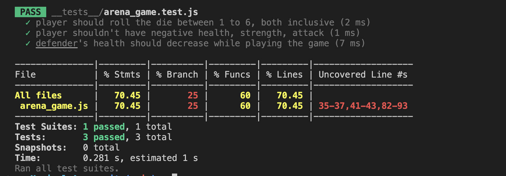

# Magical Arena Game - By Ishank Bansal

> **_NOTE:_** Install `node` in local machine if not yet installed.

### Steps to setup project locally:
- `npm install`
- `npm start` or `node src/arena_game.js`

## Preview of Arena Game:

### Code Output:

### Unit Testing:

